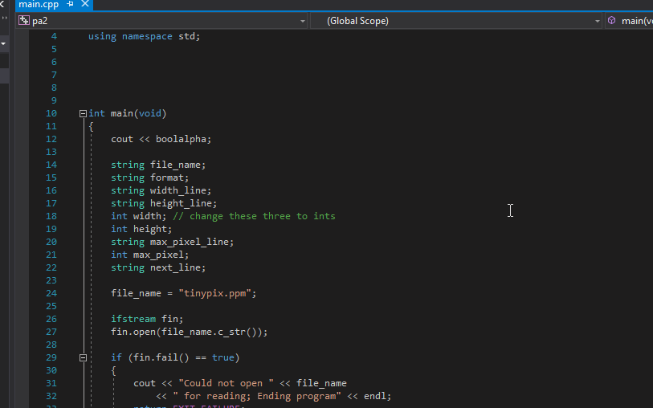

Autumn Ossello CS 112

When I first began the second project I wrote out the structure so I didn’t feel as though I was beginning from scratch. 
I then moved on to the parts of the question I definitely knew how to do, which was cout-ing to the screen and creating variables. 
At this point I was confronted with the first issue, how to convert strings to ints. After looking at a few different answers online
I figured stoi would probably be what I was looking for, but I still didn’t understand how to implement it so I put this issue to the
side and pressed on, knowing I’d have to deal with that in the future. 

Next I needed to figure out how to read from a file. I began by looking this up online as well, and used a code snippet from the
examples in my code to create a starting point. I was unfamiliar with the structure of the code, which made it more difficult to
understand and alter to my needs. After spending some time wishing I had my notes from CS 111, I went to the website with all our
notes from last semester’s CS 111 and read Mrs. Tuttle’s documentation on reading and writing to and from a file. Using both sources,
I was able to synthesize a solution that did what I wanted to for most of the lines I needed to print. 

Coming back to stoi, I asked Adam Carter for some clarity on stoi and he gave me an example call, which helped immensely and I was
able to apply it to each instance I needed to convert. Finally, a new problem with my code was brought to my attention. The way I 
was using .at meant that I could only read an image width and length that had a single character. For this I outsourced and asked 
a fellow student how they approached the issue. This led to using the third argument of getline for the first time, and a greater 
understanding of its functions. 

Overall the project boosted my confidence after the last homework, and allowed a slower introduction to github functions and using 
Visual Studio. I also gained experience solving issues through documentation online and reading the documentation in a way that I
can apply the concepts to my code. Finally, here is my PA2 walkthrough GIF.

 
